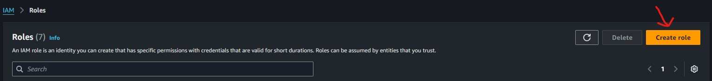
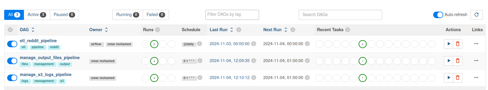

# Data Pipeline with Reddit, Airflow, Celery, Postgres, S3, AWS Glue, Athena, and Redshift

## Table of Contents
1. [Prerequisites](#prerequisites)
2. [Overview](#overview)
3. [Architecture](#architecture)
4. [System Setup](#system-setup)
5. [DAG Explanation and Scheduling](#dag-explanation-and-scheduling)
6. [System Benefits](#system-benefits)
7. [Conclusion](#conclusion)

## Prerequisites
- **System OS**: Ubuntu 22.04 or any Linux distro that can run Docker Desktop without much issues
- **Python Version**: 3.9
- **Reddit App API Credentials**
- **AWS Account** with appropriate permissions for S3, Glue, Athena, and Redshift
- **Dedicated Docker Hardware Specs**:
  - RAM: >=5GB
  - Swapfile: >=2GB
  - CPU: >=4 cores

## Overview
This system consists of multiple pipelines each with its own functions:

### Reddit_dag_etl
1. Extract data from Reddit using its API.
2. Store Reddit data transformed (timestamped) by Airflow to the output folder.
3. Store the output folder data into an S3 bucket from Airflow.
4. Transform the data using AWS Glue (locally using AWS Glue Docker container or on the cloud using AWS Glue job).
5. Catalog the transformed data using AWS Glue crawler.
6. Load the transformed data into Amazon Redshift, Amazon Athena, Power BI, Amazon QuickSight, Tableau, and Looker Studio for analytics and querying.

### Airflow_s3_logs_etl
1. Deleting Airflow DAG run logs that are older than 30 days on the Airflow S3 logs bucket.

### Output_folder_manager_etl
1. Delete Reddit data files in the output folder and the shared_folder that are older than 30 days.
2. Copy the newer Reddit data files from the output folder to the shared_folder (we assume that it's a shared folder between multiple computers).

## Architecture
- **Reddit API**: Source of the data
- **Apache Airflow & Celery**: Orchestrates the ETL process and manages task distribution
- **PostgreSQL**: Temporary storage and metadata management
- **Amazon S3**: Raw data storage and Airflow logs storage
- **AWS Glue**: Data cataloging and ETL jobs
- **Amazon Athena**: SQL-based data transformation and analytics
- **Amazon Redshift**: Data warehousing and analytics

## System Setup
1. Setup the IAM user with the required privileges:
   
   

2. After creating the IAM user with any username you want, add an access key to it and then export and save it with you as we will need it later:
   

3. Setup the IAM role for the Glue job:
   
   

4. Setup the Reddit data S3 bucket with any name you want (remember the name as we will need it later) with the required folders inside it:
   
   

5. Setup the Airflow logs S3 bucket with any name you want (remember the name as we will need it later) with the required folders inside it:
   
   

6. Clone this repo. then execute the setup_folders.bash

7. Inside the `remote_glue_reddit_job.py`, write the value of the `aws_s3_raw_file_name` variable to any filename you want. Same with `aws_s3_transformed_file_name` variable (remember their names as we will need it later).

8. Setup the AWS Glue ETL job using the `remote_glue_reddit_job.py` and remember the name of the job as we will need it later and do not run the job after saving it:
   
   
   

9. Setup the AWS Glue crawler and point its data source location to the transformed folder and set up its database on to which it will dump the output data catalog and remember the name of the crawler as we will need it later and do not run the crawler:
   
   
   

10. If you haven't installed AWS CLI, install it in your home folder using this guide ["AWS CLI Installation Guide"](https://docs.aws.amazon.com/cli/latest/userguide/getting-started-install.html) then configure AWS CLI using the `aws configure` command. Enter the access key ID of the IAM user you created previously, then the secret key, region, and finally the output type (make it JSON).

11. In the `airflow.cfg` file, write the path of the Airflow log folder in the `remote_base_log_folder` variables in the logging and core sections but keep all the lines commented out.

12. In the `.env` file, write the path to your `.aws` folder in the `AWS_CREDINTIALS_PATH`, write your AWS profile name in `AWS_PROFILE`, and finally write the path to your Docker socket (usually `/var/run/docker.sock`).

13. In the `config.conf` file, write the filename of the Reddit CSV file inside the output folder `reddit_output_file_name` (will be prefixed by a timestamp in the Reddit DAG). Write your Reddit API keys, AWS access key ID, secret key, and region. Your AWS Reddit data bucket name in `aws_bucket_name`, Glue job name, Glue crawler name, the name of the raw file in the `raw` S3 folder which will then be preprocessed by the Glue job (must match `aws_s3_raw_file_name` in `remote_glue_reddit_job.py`), the name of the transformed file in the `transformed` S3 folder (must match `aws_s3_transformed_file_name` in `remote_glue_reddit_job.py`), Airflow log bucket, Airflow log (key/folder location) inside the log bucket, and finally whether to use local Glue script or not by setting `use_local_glue_transform_script` either to true or false.

14. (Optional) Setup a virtual Python 3.9 environment using `venv` with the name `.venv` inside the project folder, then install the dependencies inside the `requirements-dev.txt` using `pip` in the virtual environment.

15. Start the Docker containers with `docker compose up -d --build`:
   

16. If the Airflow web server didn't start up correctly the first time (as it usually does), then turn off the entire container stack from the Docker GUI and start again from the start button:
   
   Or just build again with `docker compose up -d --build`.

17. When you log in to the Airflow server using the username and password "admin", you will find that all the DAGs are paused by default (that is because of setting `is_paused_upon_creation` to true on all DAGs in the `dags` folder and on the first successful launch of the Airflow server the DAGs get created. Therefore, they are paused) which is good because we need to set up one last thing on the server.

18. Click on the admin button, you will see a dropdown menu. Select connections and set up a new one using the plus button. The connection type is AWS (Amazon Web Service) and write the ID of the connection (must match the `remote_log_conn_id` in `airflow.cfg` file), then write out the access key ID and secret key of the user we created on Amazon IAM. Test the connection; if you see a green bar appear on the top of the page, then the connection is good to go and you can save it. (This connection that we just set up will help us ship the Airflow DAG run logs to our Airflow logs S3 bucket, achieving the concept of log shipping without writing out a single line of code).

19. Turn off the Docker container stack again from the GUI, then uncomment all the lines in `airflow.cfg` and lastly turn on the container stack again.

20. Congratulations, the project is now set up and ready to go. First, enable the `etl_reddit_pipeline` using the toggle right next to it, then watch its progress by right-clicking on it. All the tasks should complete successfully if everything is set up correctly. Then after the DAGs successfully finish, you can then enable the remaining DAGs `manage_output_files_pipeline` and `manage_s3_logs_pipeline`:
   
   
   
   
   
   
   
   
   
   
   

## DAG Explanation and Scheduling

### etl_reddit_pipeline
- **Description**: This DAG is responsible for extracting data from Reddit using its API, transforming the data, and storing it in an S3 bucket. The data is then further processed using AWS Glue and cataloged using AWS Glue crawler. Finally, the transformed data is loaded into Amazon Redshift, Amazon Athena, Power BI, Amazon QuickSight, Tableau, and Looker Studio for analytics and querying.
- **Schedule**: Runs daily at midnight UTC.
- **Tasks**:
  1. **Extract Data**: Extracts data from Reddit using its API.
  2. **Transform Data**: Transforms the extracted data and stores it in the output folder.
  3. **Upload to S3**: Uploads the transformed data to an S3 bucket.
  4. **Run Glue Job**: Runs the AWS Glue job to further process the data.
  5. **Run Glue Crawler**: Runs the AWS Glue crawler to catalog the transformed data.
  6. **Load to Redshift/Athena**: Loads the transformed data into Amazon Redshift and Amazon Athena for analytics and querying.

### manage_output_files_pipeline
- **Description**: This DAG is responsible for managing the output files generated by the `etl_reddit_pipeline`. It deletes Reddit data files in the output folder and the shared_folder that are older than 30 days and copies the newer Reddit data files from the output folder to the shared_folder.
- **Schedule**: Runs daily at 1:00 AM UTC.
- **Tasks**:
  1. **Delete Old Files**: Deletes Reddit data files in the output folder and the shared_folder that are older than 30 days.
  2. **Copy New Files**: Copies the newer Reddit data files from the output folder to the shared_folder.

### manage_s3_logs_pipeline
- **Description**: This DAG is responsible for managing the Airflow DAG run logs stored in the S3 bucket. It deletes Airflow DAG run logs that are older than 30 days.
- **Schedule**: Runs daily at 1:00 AM UTC.
- **Tasks**:
  1. **Delete Old Logs**: Deletes Airflow DAG run logs that are older than 30 days from the S3 bucket.

## System Benefits
1. Fully automated Reddit ETL pipeline that not only automates the finetuning and transforming of data to the desired specs but also automates the launch of the Glue crawler to refresh our AWS Glue data catalog with the new data so that on a daily basis, AWS Athena, AWS Redshift, Tableau, Power BI, and more can get access to the latest data without having to do much of anything at all other than what the `etl_reddit_pipeline` DAG already does.
2. Fully automated Airflow logs management by default, it deletes DAG run logs that are older than 30 days (`manage_s3_logs_pipeline`).
3. Fully automated management of the CSV files with timestamps to indicate when they entered the pipeline processing. This is useful for debugging; for instance, if the data on a specific date caused some issues while running through our pipeline, then we know which version of the data caused these issues to include it in our debugging sessions and hopefully be able to replicate these issues and solve them.
4. Automatically copies the CSV files from the output folder to the shared_folder (assuming it's a shared folder between multiple computers) and deletes files that are older than 30 days on both the output folder and the shared_folder.
5. Data versioning as we copy multiple versions of data from different dates from the output folder to the shared_folder.
6. The ability to run the Glue transformation locally given you have enough hardware to handle the amount of data to be processed as processing data on the cloud with AWS Glue can get quite expensive as data to be processed gets larger.

## Conclusion
This project demonstrates a robust and fully automated data pipeline that integrates various technologies such as Reddit API, Apache Airflow, Celery, PostgreSQL, Amazon S3, AWS Glue, Amazon Athena, and Amazon Redshift. The pipeline efficiently handles data extraction, transformation, and loading processes, ensuring that the latest data is always available for analytics and querying. The automated management of logs and output files further enhances the system's reliability and maintainability. Overall, this project showcases the power of combining cloud services and orchestration tools to build scalable and efficient data pipelines.